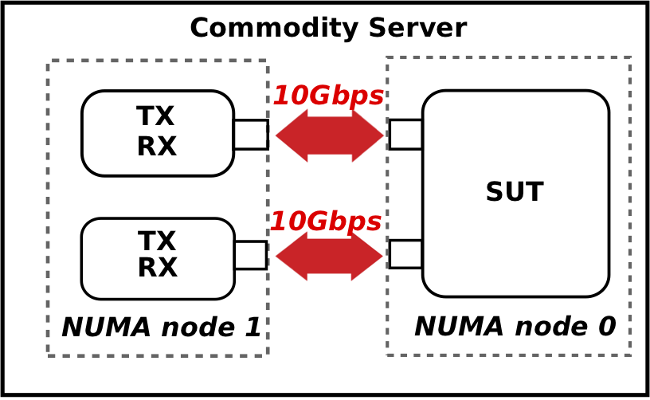

# Comparing the Performance of State-of-the-Art Software Switches for NFV
This repository contains scripts to reproduce all the experiments we conducted to compare performance of seven state-of-the-art software switches, namely OVS-DPDK, VPP, snabb, BESS, VALE, t4p4s, and FastClick. All the results and numbers shown in the slides and papers are reproducible on our server. We expect similar results from other testbeds. So you're welcome to download the scripts and run the tests on your server. Any feedback or suggestions are highly appreciated!!! 

We consider 7 state-of-the-art software switches in our project, including:
* [OVS-DPDK](http://docs.openvswitch.org/en/latest/intro/install/dpdk/): an accelerated version of Open vSwitch based on Intel DPDK.
* [SnabbSwitch](https://github.com/snabbco/snabb): a modular software switch based on LuaJIT.
* [FastClick](https://github.com/tbarbette/fastclick): a Click modular router based on Intel DPDK.
* [BESS](https://github.com/NetSys/bess) (previously named SoftNIC): a software switch aiming at augmenting physical NICs
* [netmap](https://github.com/luigirizzo/netmap) (including VALE switch, mSwitch and ptnet): a state-of-the-art high-speed packet I/O frameworks. Its solutions provide L2 switching functionality. We mainly focus on its **VALE switch**.
* [VPP](https://github.com/FDio/vpp): an open-source full-fledged software router implemented by Cisco.
* [t4p4s](https://github.com/P4ELTE/t4p4s): a P4 switch based on Intel DPDK.

## Introduction
We performed performance comparison under 4 test scenarios: p2p, p2v, v2v, and loopback.

A detailed description of test scenarios and experimental results can be found on [our demo website](https://ztz1989.github.io/software-switches.github.io/examples/dashboard.html). The detailed instructions to reproduce the described tests for each considered software switch can be found as follows:
* [OVS-DPDK](https://github.com/ztz1989/software-switches/tree/artifacts/ovs-dpdk)
* [FastClick](https://github.com/ztz1989/software-switches/tree/artifacts/fastclick)
* [BESS](https://github.com/ztz1989/software-switches/tree/artifacts/bess)
* [VPP](https://github.com/ztz1989/software-switches/tree/artifacts/vpp)
* [t4p4s](https://github.com/ztz1989/software-switches/tree/artifacts/t4p4s)
* [snabb](https://github.com/ztz1989/software-switches/tree/artifacts/snabb)
* [VALE](https://github.com/ztz1989/software-switches/tree/artifacts/netmap)

## Metrics
We measure both throughput and latency under the four test scenarios for each software switch.

### Throughput
We performed throughput test for each software switch, both unidirectionally and bidirectionally. To view the performance under different patterns, we injected synthetic traffic with identical packets of 3 different sizes: 64B, 256B, and 1024B. 

### Latency
For latency test, we transmitted UDP/PTP packets towards one interface of the software switch and collected them from another port to calculate the latency (in terms of RTT). Our experiments relied on the hardware and software timestamping features of MoonGen to measure latency in different test scenarios. More details can be found [here](https://github.com/ztz1989/software-switches/tree/artifacts/moongen#latency-test).

## Testbed settings
We conducted all the tests on a single commodity off-the-shelf server. The layout is illustrated as follows:

Our server consists of two NUMA sockets, each of which is attached an Intel 52599 dual-port 10Gbps network interface card (NIC). As shown by the figure, each physical port is **directly** cabled to another port on the other NUMA node. The software switch under test (along with its associated virtual machines) are deployed on NUMA node 0 (SUT in the figure), while other measurement tools including traffic generators (TX) and montiors (RX) are deployed on NUMA node 1. Note that the software switch is pinned to a single core. Extension to multiple cores is left for future work.

## Tools for measurement
Our experiments adopted several software tools for different test scenarios

* [MoonGen](https://github.com/emmericp/MoonGen): A high-speed traffic generator based on LuaJIT and DPDK. In our experiments, MoonGen is used in all the 4 test scenarios to generate predefined traffic load. It is also used to measure both throughput and latency for p2p and loopback scenarios. Please refer to the README file inside the directory of each software switch for a detailed usage of MoonGen.
* [FloWatcher-DPDK](https://github.com/ztz1989/FloWatcher-DPDK): A lightweight software traffic monitor based on DPDK. It is used in the p2v and v2v test scenarios to measure unidirectional throughput for all the software switches except VALE.
* [pkt-gen](https://github.com/luigirizzo/netmap/tree/master/apps/pkt-gen): A high-speed traffic generator based on netmap API. It is used to measure throughput for p2v and v2v scenarios for the VALE switch.
* [DPDK l2fwd](https://doc.dpdk.org/guides-18.08/sample_app_ug/l2_forward_real_virtual.html): DPDK L2 fowarding sample application. It is deployed as VNF inside virtual machines. We use it to rely packets between virtual machines and construct a linear service function chain.

A detailed description about VNF deployment inside QEMU VMs can be found [here](https://github.com/ztz1989/software-switches/blob/artifacts/README-VM.md). We also provide a setup script **setup.sh** to provision all the physical part of our test.

## Quick start guide
Please refer to [quick start section]() for a quick start.
